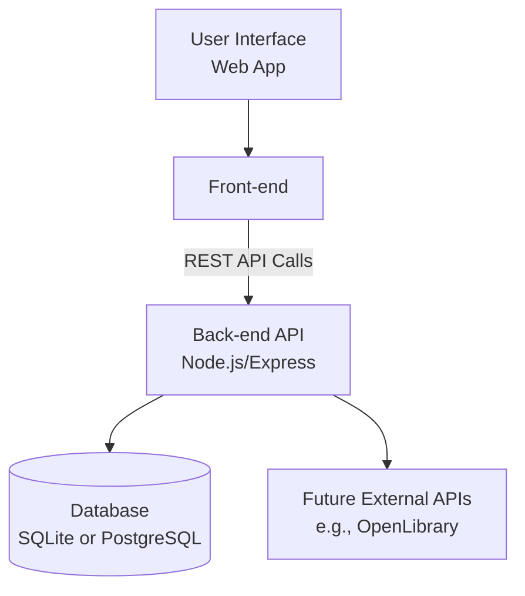
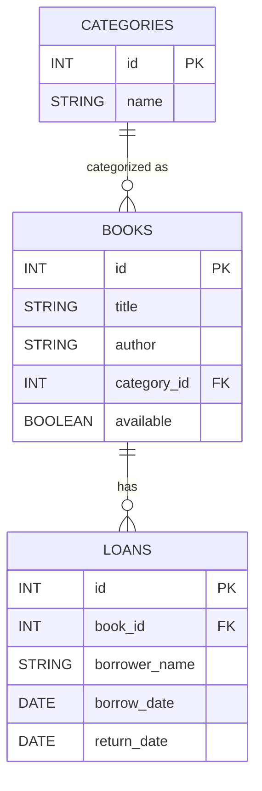
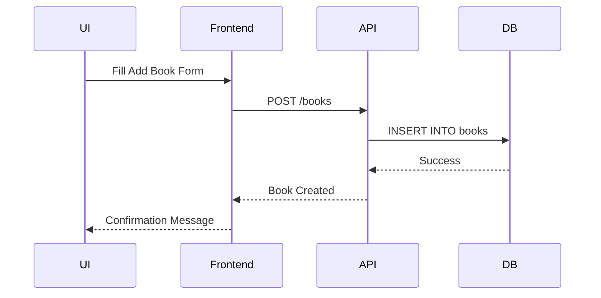
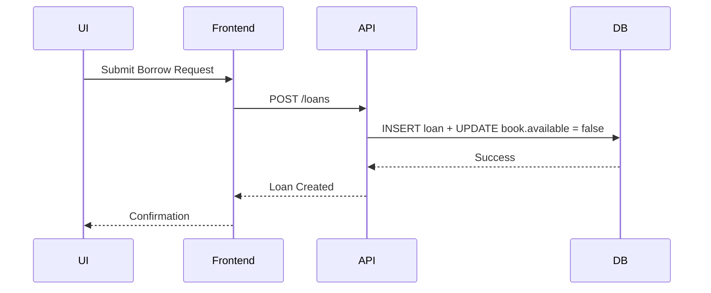

#  Technical Documentation – School Library Management App

## 1. User Stories and Mockups

### Prioritized User Stories (MoSCoW)

#### Must Have
- As a school staff member, I want to add books to the database, so that they can be borrowed.
- As a borrower (student or teacher), I want to borrow a book, so that I can read it and return it later.
- As a librarian, I want to track which books are currently borrowed, so that I can manage inventory.

#### Should Have
- As a staff member, I want to search for a book by title or category, so that I can quickly find it.
- As a borrower, I want to see my current and past loans, so I can track my reading.

#### Could Have
- As a user, I want to filter books by availability, so I can avoid requesting unavailable books.
- As a librarian, I want to categorize books, so that the database is easier to navigate.

#### Won’t Have
- User authentication or role-based access (in MVP).
- ISBN auto-fill via external API.

### Mockups

Basic wireframes created in Figma for:
- Home Dashboard (book listing)
- Add Book form
- Loan Management

## 2. System Architecture

## 3. Components, Classes, and Database Design

### Backend Classes / Controllers

- BookController: createBook(), getBooks(), updateBook(), deleteBook()
- LoanController: borrowBook(), returnBook(), getLoans(), getLoanHistory()
- CategoryController: createCategory(), getCategories()

### Frontend Components (Planned with basic React/Vite)

- `BookList`, `BookForm`, `LoanForm`, `LoanList`, `CategoryList`

### Relational Database Schema (ER Diagram)

## 4. Sequence Diagrams

### A. Add a Book

### B. Borrow a Book

## 5. API Specifications

### External APIs

- None used in MVP.

### Internal API Endpoints

| Endpoint            | Method             | Description                   |
| ------------------- | ------------------ | ----------------------------- |
| `/books`            | GET / POST         | List / Add books              |
| `/books/:id`        | GET / PUT / DELETE | View, update or delete a book |
| `/loans`            | GET / POST         | List loans / Borrow a book    |
| `/loans/:id/return` | PATCH              | Return a book                 |
| `/loans/history`    | GET                | Past loans                    |
| `/categories`       | GET / POST         | Manage categories             |

All endpoints use JSON input/output.

## 6. SCM and QA Plans

### Source Control Management (SCM)

- Tool: Git + GitHub
- Branches:
    - main: production
    - dev: current development
    - feature/*: specific feature branches
- Workflow: Pull requests → Code Review → Merge to dev

### Quality Assurance (QA)

| Test Type   | Tool                | Scope                         |
| ----------- | ------------------- | ----------------------------- |
| Unit Tests  | Jest / Vitest       | Backend controllers and logic |
| Integration | Postman / Supertest | API endpoints                 |
| Manual      | Browser testing     | UI flow checks                |

- Code linting: ESLint + Prettier
- Pre-deploy checks: Manual tests for core features

## 7. Technical Justifications

| Decision                      | Rationale                                                                                                                    |
| ----------------------------- | ---------------------------------------------------------------------------------------------------------------------------- |
| **Tech Stack**                | Simple and accessible stack (HTML/CSS/JS + Express + SQLite/PostgreSQL) chosen for quick deployment and ease of maintenance. |
| **No external APIs in MVP**   | Ensures the app works offline or with limited connectivity. Adds simplicity.                                                 |
| **Modular backend structure** | Easier testing, debugging and future upgrades.                                                                               |
| **Relational DB**             | Relationships between books, loans, and categories are structured and ideal for SQL.                                         |
| **No Auth in MVP**            | Simplifies usage for schools with shared access terminals. May be added later if needed.                                     |
