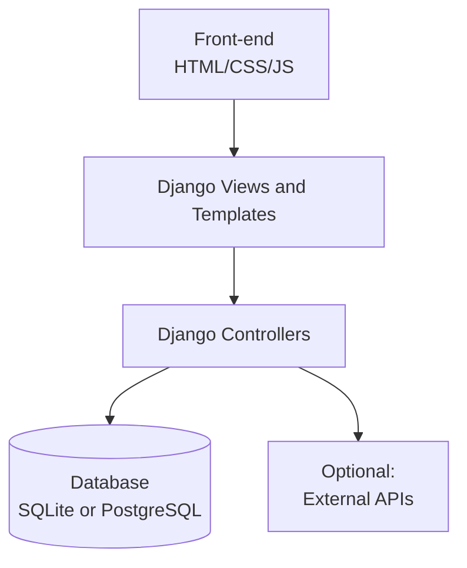
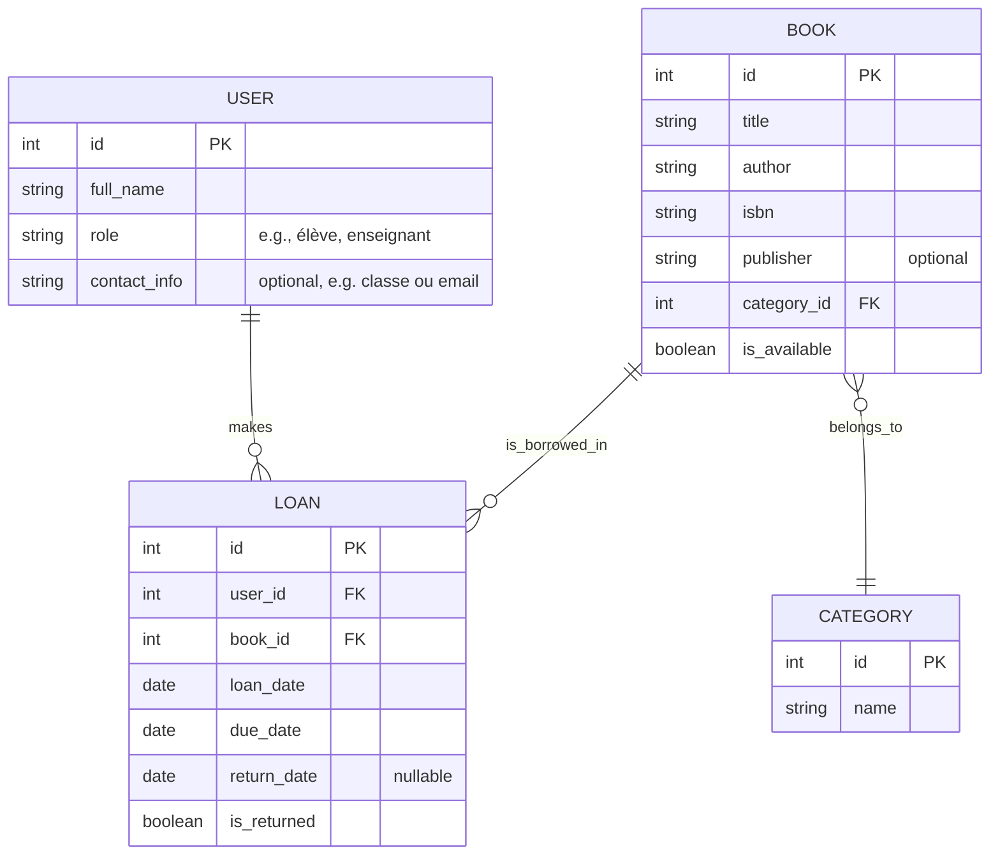
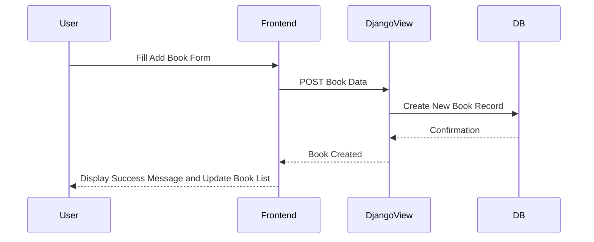
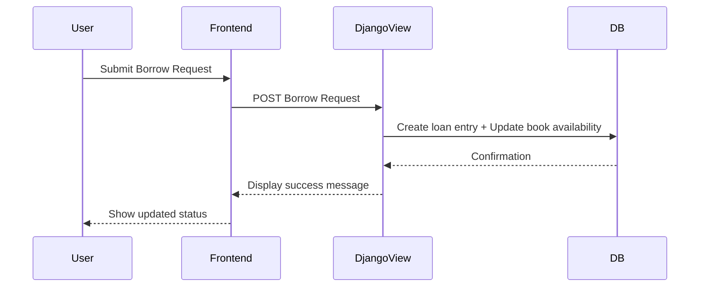
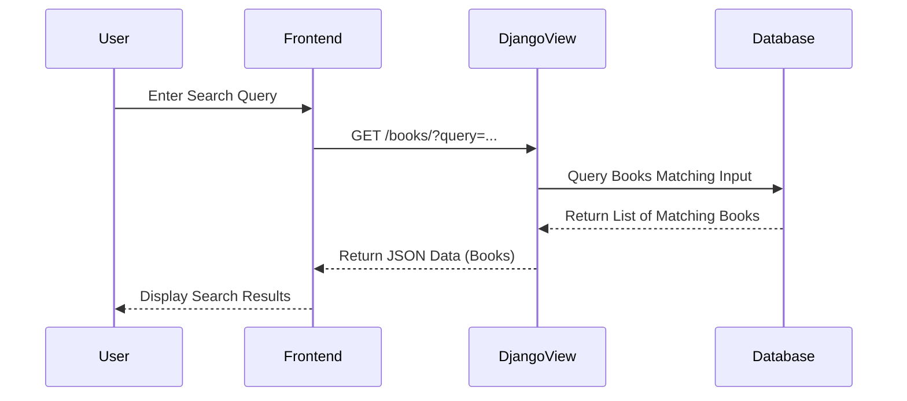

#  Technical Documentation - School Library Management App

## 1. User Stories and Mockups

### Prioritized User Stories (MoSCoW)

#### Must Have
- As a school staff member, I want to add books to the database, so that they can be borrowed.
- As a borrower (student or teacher), I want to borrow a book, so that I can read it and return it later.
- As a librarian, I want to track which books are currently borrowed or returned, so that I can manage inventory.
- As a user, I want to search for a specific book by title or author, so that I can find it quickly.

#### Should Have
- As a staff member, I want to categorize books(e.g., novels, documentaries), so that they're easier to organize and find.
- As a user, I want to filter books by category or status (available/ Not available), so that I can narrow my search.
- As a staff member, I want to edit or delete book records, so that I can correct mistakes or remove old data.

#### Could Have
- As a user, I want to view some statistics, so that i know what's popular in the library.

#### Won't Have
- User authentication or role-based access (in MVP).
- ISBN auto-fill via external API.

### Mockups

Basic wireframes created in Figma for:
- Home Page
- Add Book form
- Book Detail Page
- Search and Filter Page

## 2. System Architecture



## 3. Components, Classes, and Database Design

### Django Components

- Models: Book, User, Loan
- Views: ListView, DetailView, CreateView, UpdateView
- Templates: book_list.html, book_detail.html, loan_form.html

### Models

```
class Book(models.Model):
  title = models.CharField(max_length=200)
  author = models.CharField(max_length=200)
  isbn = models.CharField(max_length=13, unique=True)
  category = models.CharField(max_length=200)
  available = models.BooleanField(default=True)

class Loan(models.Model):
  book = models.ForeignKey(Book, on_delete=models.CASCADE)
  borrower = models.CharField(max_length=200)
  borrowed_date = models.DateField(auto_now_add=True)
  return_date = models.DateField(null=True, blank=True)
```

### Relational Database Schema (ER Diagram)



## 4. Sequence Diagrams

### A. Add a Book



### B. Borrow a Book



### C. Search for a Book



## 5. API Specifications

### External APIs

- None used in MVP.

### Internal API Endpoints

| Endpoint           | Method | Description                                             |
| ------------------ | ------ | ------------------------------------------------------- |
| `/api/books/`      | GET    | Retrieve a list of all books or filter by search query. |
| `/api/books/<id>/` | GET    | Retrieve detailed information about a specific book.    |
| `/api/books/`      | POST   | Add a new book to the library database.                 |
| `/api/books/<id>/` | PUT    | Update information about an existing book.              |
| `/api/books/<id>/` | DELETE | Delete a book from the library database.                |
| `/api/borrow/`     | POST   | Create a new loan for a book (borrow action).           |
| `/api/return/`     | POST   | Register the return of a borrowed book.                 |
| `/api/loans/`      | GET    | Retrieve all loan records (active or complete).         |
| `/api/loans/<id>/` | GET    | Retrieve detailed information about a specific loan.    |

## 6. SCM and QA Plans

### Source Control Management (SCM)

- Tool: Git + GitHub
- Branches:
    - main: production
    - dev: current development
    - feature/*: specific feature branches
- Workflow: Pull requests → Code Review → Merge to dev

### Quality Assurance (QA)

- Testing Types:
  - Unit Tests (Django built-in testing tools)
  - Manual UI Testing
- Tools:
  - `pytest`, Django TestCase
  - Browser-based manual test

## 7. Technical Justifications

| Decision                              | Rationale                                                                                                                                        |
| ------------------------------------- | ------------------------------------------------------------------------------------------------------------------------------------------------ |
| **Tech Stack: Python + Django**       | Chosen for familiarity, rapid development, and excellent admin interface; Django's ORM simplifies database operations.                           |
| **Future-ready with Python/Django**   | Anticipates future needs such as authentication, multi-school support, and AI integration thanks to Django's scalability and Python's ecosystem. |
| **No external APIs in MVP**           | Keeps the MVP lightweight, fully offline-capable, and reduces dependency complexity.                                                             |
| **Modular backend structure**         | Django's app system allows clean separation of concerns, facilitating scalability and easier maintenance.                                        |
| **Relational DB (SQLite/PostgreSQL)** | Ideal for structured data like books and loans. SQLite used in development; PostgreSQL recommended for production.                               |
| **No Auth in MVP**                    | Simplifies initial access for shared computers in schools. Authentication can be added in future iterations.                                     |